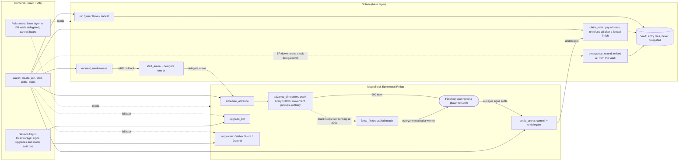

# glue

glue is a real-time autonomous bot arena on Solana, built with MagicBlock Ephemeral Rollups.
 
Each player owns one bot. Bots compete autonomously to collect resources in a shared arena. Players do not control bot movement; they influence the outcome by switching modes and purchasing upgrades mid-match. Entry fees form the pot, and after about 90 seconds, the game ends, and the highest scoring player takes the pot.

Play on devnet: https://glue-2cb.pages.dev/

Program ID: `EVh92BTdvhGSwQ2tx3wgZftuRfsP2oXfEcUmXoSwP9Hd`

## How to play
You need a Solana wallet (e.g. Phantom) on devnet with some devnet SOL (free from a [faucet](https://faucet.solana.com/)). On mobile, open the site in your wallet app's built-in browser.
1. **Host** creates an arena, sets the entry fee in SOL, and shares the invite link.
2. **Players** (2–6) join by paying the entry fee.
3. **The match** runs for about 90 seconds. Bots chase the nearest resource inside their field of vision (the circle around them) and wander when nothing is in sight. Each resource is worth 10 points and 10 credits.
4. **Upgrades** cost 10 credits: **Speed** (+1 cell per step) or **Vision** (+1 radius). Spending credits never lowers your score.
5. **Modes** include Gather, Hunt, and Defend. In Gather mode, bots collect resources. In Hunt mode, bots can chase other bots and steal up to 20 points from them, but collect no resources. In Defend mode, bots can't be robbed, but move 1 cell per step slower and collect half rewards. A bot that's just been robbed is protected and can't rob or be robbed for 5 seconds.
6. **Payout** goes to the top score; ties split it.

## Architecture



- **The arena** (bots, resources, ticks, scores) is delegated to the ER for the match, so that the simulation can run at 10 ticks/second.
- **The vault** holds the entry fees and stays on the base layer.
- **`schedule_advance`** enforces the crank interval (100ms) and enough iterations to finish a match (900 ticks, about 90 seconds). A slower crank only lengthens the match, and a stall past 200s ends in a full refund via `force_finish`.
- **The frontend picks the network by account owner.** It reads the arena from the base layer or from the ER while the delegation program owns it, polling every 150ms during a match. The screen (landing, lobby, arena, result) follows the arena's on-chain status, so every player switches screens together when the host starts the match.
- A throwaway keypair (**Session key**) valid for 20 minutes is generated per arena, registered in the create/join transaction, and stored in `localStorage`. While valid, it signs upgrades and mode changes on the ER without wallet popups. After expiry, a background sweep revokes the key and returns its leftover SOL to the wallet.
- **The board** is a canvas redrawn every frame; bots glide between on-chain positions.
- After the match, any player's wallet signs `settle_arena` on the ER ("Claim prize" for the winner, "Finalize results" for others). That commits the final state and undelegates the arena so the claim can run on the base layer.

## MagicBlock features used

| Feature | Where |
|---|---|
| Ephemeral Rollups (delegation) | `start_arena` + `delegate` in one transaction move the arena into the ER |
| Cranks | `schedule_advance` runs `advance_simulation` every 100ms on the ER: movement, pickups and robbery |
| Commit + undelegate | `settle_arena` writes the final state back and returns the arena to the base layer |
| VRF | `request_randomness` / `consume_randomness` seed spawns and wandering (scoped per-program identity) |
| Session keys | `upgrade_bot` and `set_mode` accept a `SessionTokenV2`, created in the same transaction as joining: no popups during play |

## Safety and recovery
- **`force_finish`:** if a match stalls for 200s (e.g. the crank stops), anyone can end it and every entry fee is refunded.
- **`emergency_refund`:** if the arena is stuck delegated (e.g. the ER is down), anyone can refund every player from the vault after 5 hours.
- **VRF reroll guard:** one seed per arena; later callbacks are ignored.
- **Session scope:** a session key can only call `upgrade_bot` and `set_mode`, and only for its own wallet's bot. It cannot touch the pot or the player's wallet.

## Running locally
Prerequisites: Rust, Solana CLI, Anchor 1.0.2, Node, a devnet RPC URL (e.g. Helius)

### Option A: frontend only, against the deployed devnet program (no deploy)
```bash
# frontend
cd frontend
npm install
echo "VITE_HELIUS_RPC_URL=<your devnet RPC>" > .env
npm run dev
```

### Option B: deploy your own copy of the program
```bash
anchor build          # generates target/deploy/glue-keypair.json
anchor keys sync      # rewrites declare_id! and Anchor.toml to the new program ID
anchor build          # rebuild with the new ID
solana program deploy target/deploy/glue.so --url devnet

cd frontend
npm run idl           # copies the IDL (with your new program address) into src/idl
npm install
echo "VITE_HELIUS_RPC_URL=<your devnet RPC>" > .env
npm run dev
```

## Testing
```bash
anchor build
cargo test
```
Testing is done with LiteSVM in `programs/glue/tests/`. Shared helpers live alongside four suites: `arena`, `claim`, `emergency`, `modes` and `upgrades`. The suites cover every path that moves SOL, session-signed upgrades, and mode changes.

**Session program:** `tests/fixtures/session_keys.so` was **dumped from devnet**, so tokens are created by the real program:
```bash
  solana program dump -u d KeyspM2ssCJbqUhQ4k7sveSiY4WjnYsrXkC8oDbwde5 programs/glue/tests/fixtures/session_keys.so
```

## Repo layout

```
glue/
├── Anchor.toml
├── Cargo.toml
├── programs/glue/
│   ├── src/
│   │   ├── lib.rs                 # program entrypoint: instruction list (#[ephemeral] #[program])
│   │   ├── constants.rs           # game, timing, robbery, fee and address constants
│   │   ├── error.rs               # ArenaError codes
│   │   ├── state.rs               # ArenaAccount, VaultAccount, Bot, BotMode, finalize(), helpers
│   │   └── instructions/
│   │       ├── init_arena.rs          # base: create arena + vault, host pays entry fee
│   │       ├── join_arena.rs          # base: pay entry fee into the vault
│   │       ├── leave_arena.rs         # base: refund before start
│   │       ├── cancel_arena.rs        # base: host refunds everyone before start
│   │       ├── request_randomness.rs  # base: request VRF seed
│   │       ├── consume_randomness.rs  # base: VRF callback (first seed wins)
│   │       ├── start_arena.rs         # base: spawn bots/resources, sets started_at
│   │       ├── delegate.rs            # base: delegate arena to the ER (same tx as start)
│   │       ├── schedule_advance.rs    # ER: schedule the 100ms crank
│   │       ├── advance_simulation.rs  # ER: one tick (mode-aware movement, pickups, robbery, spawns, finish)
│   │       ├── upgrade_bot.rs         # ER: speed/vision upgrade (wallet or session key)
│   │       ├── set_mode.rs            # ER: switch Gather / Hunt / Defend (wallet or session key)
│   │       ├── force_finish.rs        # ER or base layer: end a stalled match (refund)
│   │       ├── settle_arena.rs        # ER: commit + undelegate
│   │       ├── claim_prize.rs         # base: pay winners from the vault, close accounts
│   │       └── emergency_refund.rs    # base: refund from the vault if stuck delegated
│   └── tests/
│       ├── helpers/mod.rs         # LiteSVM setup, instruction builders, state writers
│       ├── arena.rs               # init / join / leave / cancel
│       ├── claim.rs               # payouts, ties, forced refunds, refunded-then-claimed
│       ├── emergency.rs           # emergency refund guards and payout
│       ├── upgrades.rs            # wallet and session-key upgrades
│       ├── modes.rs               # set_mode, robbery, cooldowns, rotation, Defend rewards and speed
│       └── fixtures/session_keys.so   # session program, dumped from devnet
└── frontend/
    ├── index.html                 # tab title, favicon link
    ├── public/favicon.svg
    └── src/
        ├── main.tsx               # React entry
        ├── App.tsx                # screen selection from on-chain state; session sweep
        ├── index.css              # base styles
        ├── styles.css             # app styles (scoped under .glue)
        ├── idl/                   # committed IDL + types (copied from target/ via `npm run idl`)
        ├── hooks/useArena.ts      # polls the arena from the base layer or ER
        ├── lib/
        │   ├── anchor.ts          # connections, program clients, PDAs, constants
        │   ├── session.ts         # session keys: create, store, sign, sweep
        │   ├── names.ts           # player name encoding/decoding
        │   ├── colours.ts         # bot colours
        │   └── waitFor.ts         # polling helper
        ├── components/
        │   ├── Grid.tsx           # canvas board: gliding bots, mode rings, robbery "−N"
        │   └── EmergencyRefund.tsx
        └── screens/
            ├── Landing.tsx
            ├── Lobby.tsx          # create / join / start (start + delegate in one tx)
            ├── Arena.tsx          # timer, board, modes, upgrades, force finish
            └── Result.tsx         # results, settle, claim
```

## Stack
- Anchor 1.0.2
- ephemeral-rollups-sdk 0.16.2
- session-keys 3.1.1
- React 19.3 + Vite 8.3
- @coral-xyz/anchor 0.32.1 (client)
- @solana/web3.js 1.99
- @magicblock-labs/gum-sdk 3.0.10
- LiteSVM 0.10
- Helius RPC (devnet)
